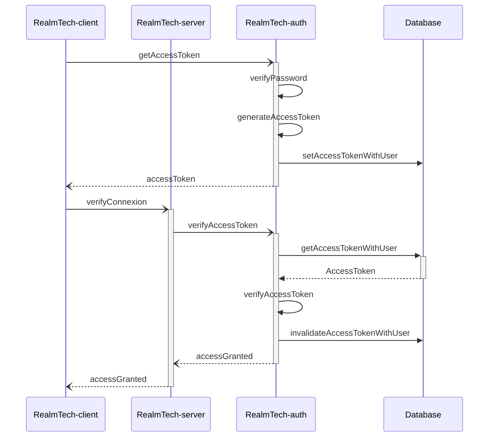
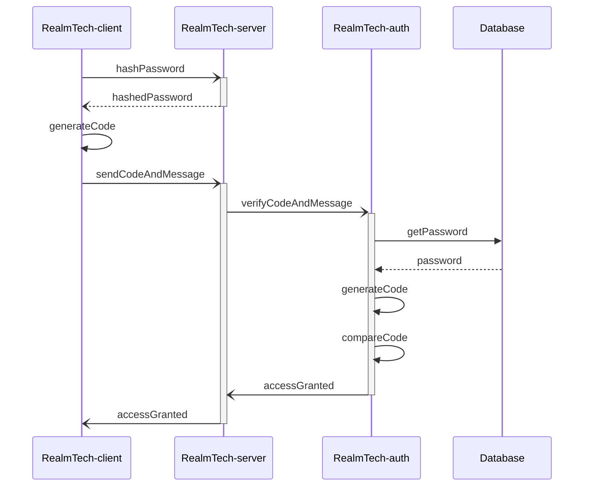
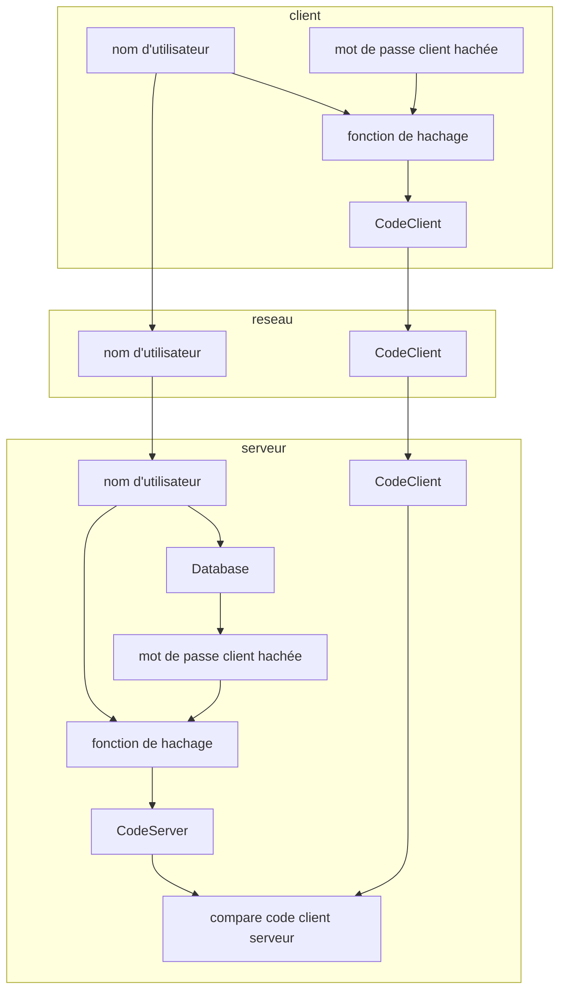

# RealmTech-auth

## introduction
RealmTech-auth est la partie d'authentification de RealmTech.
C'est ici que les utilisateur peuvent s'inscrire afin
d'avoir une persistance de leur compte joueur.

RealmTech-auth est aussi responsable pour garantir que c'est
le bon joueur qui se connect à un serveur.

## problématique
Le serveur de jeu (RealmTech-server) doit authentifie le client (RealmTech-client)
qui souhait ce connecter à un serveur de jeu grace à son identifiant stocké sur
le serveur central d'identifiant (RealmTech-auth). Les connexions avec le serveur
authentification sont considérées comme sûr. C'est là que le défi commence, car
le client doit donner des informations secrets au serveur sur une connexion
non sécurisée.

## schema d'implementation
Deux méthodes d'implementation sont possible pour garantir la sécurité.
Une méthode qui se base sur un "access token" et une autre sur
un "code".

### accessToken
La méthode d'access token propose que le serveur d'authentification génère une
token à très courte duré de vie. Le token est lié à un utilisateur. Dès que le
token est utilisé par le client, il est rendu invalide.
Cette méthode est inspiré des jwt. [Wikipedia JSON Web Token](https://fr.wikipedia.org/wiki/JSON_Web_Token)

### code
La méthode "code" propose d'utilisé d'utilisé un secret commun entre
le client et le serveur d'authentification, le mot de passe de l'utilisateur.
Grace à une fonction de hachage, le mot de passe peut être transmit de manière sûr
du client au serveur. Le message est le nom d'utilisateur pour 
permettre de récupérer le mot de passe sur le serveur.
Cette méthode est inspiré des Code d'authentification de message.
[Wikipedia Code d'authentification de message](https://fr.wikipedia.org/wiki/Code_d%27authentification_de_message)

un petit complément pour générer et vérifié le code.

