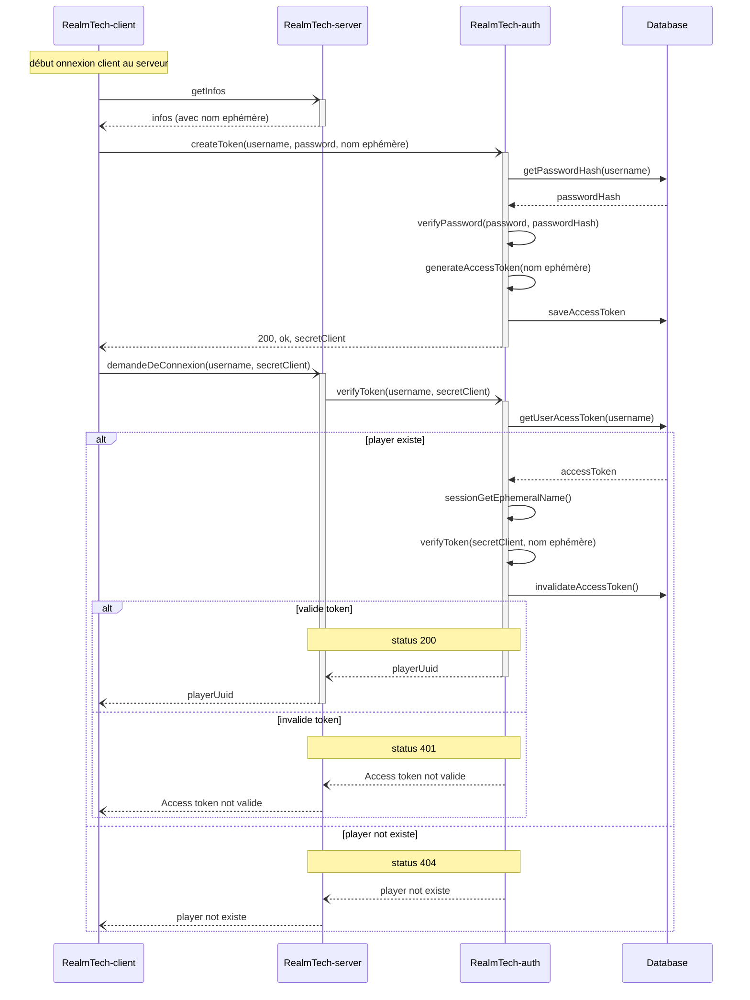
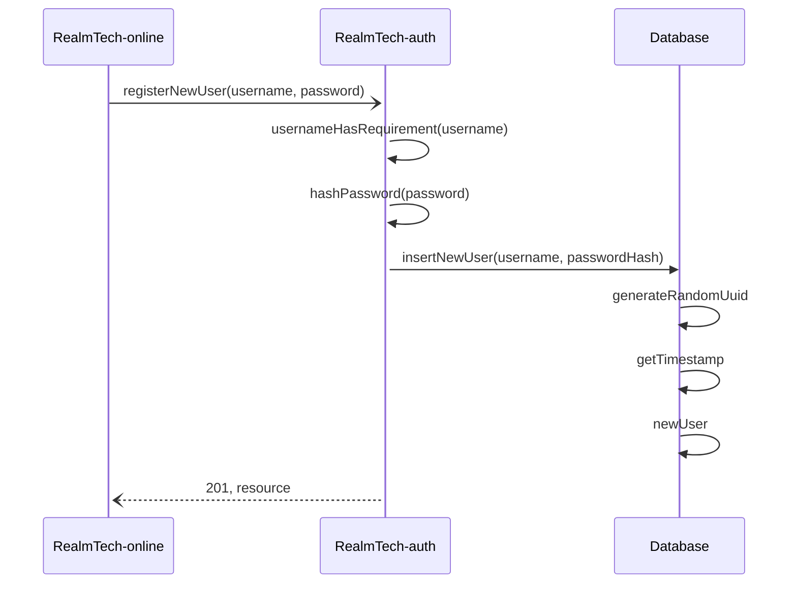

# RealmTech-auth

## introduction
RealmTech-auth est la partie d'authentification de RealmTech.
C'est ici que les utilisateur peuvent s'inscrire afin
d'avoir une persistance de leur compte joueur.

RealmTech-auth est aussi responsable pour garantir que c'est
le bon joueur qui se connect à un serveur.

## problématique
Le serveur de jeu (RealmTech-server) doit authentifie le client (RealmTech-client)
qui souhait ce connecter à un serveur de jeu grace à son identifiant stocké sur
le serveur central d'identifiant (RealmTech-auth). Les connexions avec le serveur
authentification sont considérées comme sûr. C'est là que le défi commence, car
le client doit donner des informations secrets au serveur sur une connexion
non sécurisée.

## implémentation de sécurité
### access token
La méthode d'implémentation "access token" exploit que seul le client peut modifier
la base de données. Le client va demander au serveur d'autentification de
créer un jeton d'access temporaire (access token), puis le serveur de
jeu va vérifié sur le jeton est valide.

Pour garentire que c'est le même joueur qui créer un token et qui demande
la verification, le serveur renvoie un secret temporaire. Le client doit
envoyer le secret temporaire au serveur de jeu. quand le secret est validé,
c'est la garentie que c'est la même personne qui à créer le token et qui a
demendé la vérification. Le secret temporaire est stoken dans le token (qui
est lui même stoké dans la base de données).

Le nom ephémère permet de garentire que le client se connecte au bon serveur.
Pour verifié le token du client, le serveur sont nom ephémère. Si le nom
ephémère corespond au nom dans le token, c'est que le client se connecte au bon
serveur.

#### diagramme pour vérification de l’authenticité.

## Création d'un compte
La création d'un nouveau compte se fait sur un site internet (RealmTech-online), qui
communique avec RealmTech-auth afin de créer le compte.

### Diagramme de la création d'un compte

