# RealmTech-auth

## introduction
RealmTech-auth est la partie d'authentification de RealmTech.
C'est ici que les utilisateur peuvent s'inscrire afin
d'avoir une persistance de leur compte joueur.

RealmTech-auth est aussi responsable pour garantir que c'est
le bon joueur qui se connect à un serveur.

## problématique
Le serveur de jeu (RealmTech-server) doit authentifie le client (RealmTech-client)
qui souhait ce connecter à un serveur de jeu grace à son identifiant stocké sur
le serveur central d'identifiant (RealmTech-auth). Les connexions avec le serveur
authentification sont considérées comme sûr. C'est là que le défi commence, car
le client doit donner des informations secrets au serveur sur une connexion
non sécurisée.

## implémentation de sécurité
### code
La méthode d'implémentation "code" propose d'utilisé d'utilisé un secret commun entre
le client et le serveur d'authentification, une long chaîne de character généré à l'enregistrement (userSecrete).
Le message est le nom d'utilisateur permettre de récupérer le secrete du l'utilisateur 
afin de recalculer le code.
Cette méthode est inspiré des Code d'authentification de message.
[Wikipedia Code d'authentification de message](https://fr.wikipedia.org/wiki/Code_d%27authentification_de_message)

#### diagramme pour vérification de l’authenticité.

## Création d'un compte
La création d'un nouveau compte se fait sur un site internet (RealmTech-online), qui
communique avec RealmTech-auth afin de créer le compte.

### Diagramme de la création d'un compte

```mermaid
sequenceDiagram
    participant RealmTech-online
    participant RealmTech-auth
    participant Database

    RealmTech-online -)+ RealmTech-auth: registerNewUser(username, password)
    RealmTech-auth ->> RealmTech-auth: usernameHasRequirement(username)
    RealmTech-auth ->> RealmTech-auth: hashPassword(password)
    RealmTech-auth ->> RealmTech-auth: generateSecrete
    RealmTech-auth ->> Database: insertNewUser(username, passwordHash, secrete)
    Database ->> Database: generateRandomUuid
    Database ->> Database: getTimestamp
    Database ->> Database: newUser
    RealmTech-auth --)+ RealmTech-online: 201, resource
```

un petit complément pour générer et vérifié le code.

